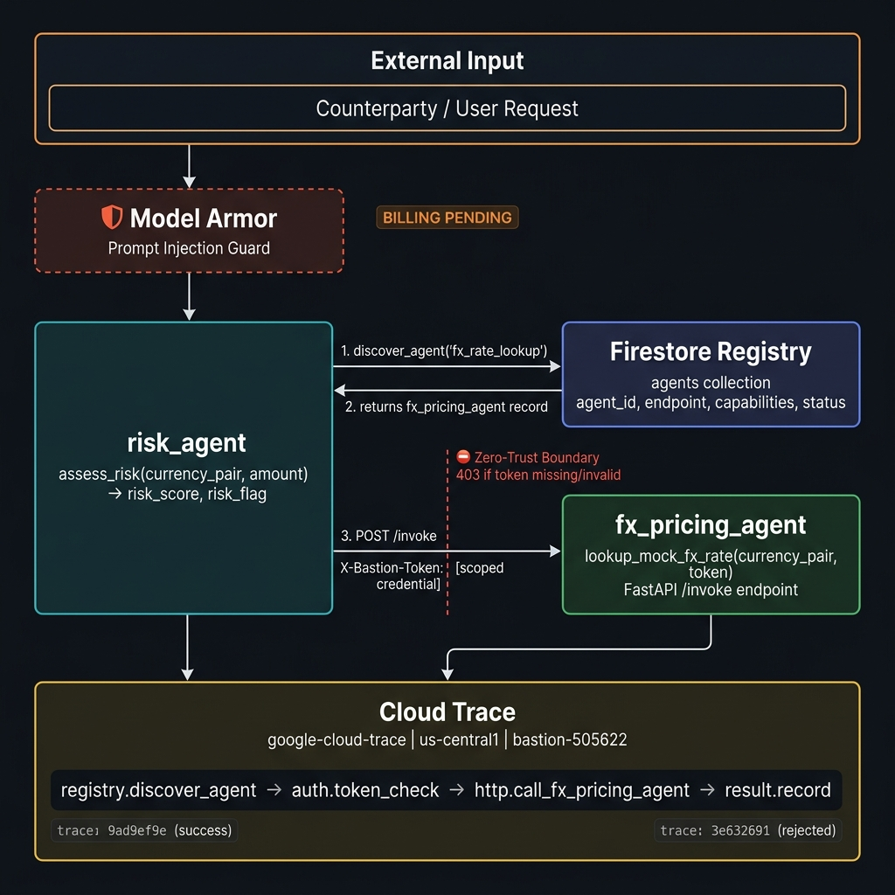

# Bastion

**Multi-agent AI infrastructure for institutional FX operations — built on Google's Antigravity SDK.**

Bastion demonstrates a production-grade agentic mesh where autonomous agents discover each other, communicate over authenticated HTTP boundaries, and are observed end-to-end through distributed tracing. Built for the Google Cloud / Antigravity Hackathon.

---

## Architecture



### How it works

1. **A request arrives** at `risk_agent` with counterparty-supplied transaction data (currency pair, amount).
2. **Model Armor** screens the input for prompt injection and jailbreak attempts before any LLM reasoning touches it. *(Live once GCP billing credit activates — code is complete.)*
3. **`risk_agent`** queries the **Firestore Registry** to discover which agent can handle FX rate lookups.
4. **The registry** returns the `fx_pricing_agent` record (endpoint, capabilities, status).
5. **`risk_agent`** calls `fx_pricing_agent`'s `/invoke` endpoint over HTTP, attaching a scoped credential in the `X-Bastion-Token` header.
6. **The zero-trust boundary** at `fx_pricing_agent` verifies the token before the agent runs — invalid or missing tokens get a hard `403 Access Denied` before any LLM call is made.
7. **Cloud Trace** instruments the entire call chain, producing a waterfall trace for every request: registry lookup → token check → HTTP call → result.

---

## Tech Stack

| Layer | Technology |
|---|---|
| Agent framework | [Google Antigravity SDK](https://pypi.org/project/google-antigravity/) (`gemini-3.5-flash`) |
| Agent API layer | FastAPI + uvicorn |
| Service registry | Google Cloud Firestore (Native mode, `us-central1`) |
| Input security | Google Cloud Model Armor (`modelarmor.googleapis.com`) — *billing pending* |
| Audit / observability | Google Cloud Trace (`cloudtrace.googleapis.com`) |
| Auth boundary | Shared-secret token via `X-Bastion-Token` HTTP header |
| Infrastructure | GCP project `bastion-505622`, `us-central1` |
| Language | Python 3.12 |

---

## Project Structure

```
bastion/
├── agents/
│   ├── fx_pricing_agent/
│   │   ├── agent.py          # Core agent logic + zero-trust tool
│   │   └── main.py           # FastAPI /invoke endpoint (token-gated)
│   ├── risk_agent/
│   │   └── agent.py          # assess_risk() — Model Armor guarded
│   └── hello_world/
│       └── agent.py          # Phase 0 SDK smoke test
├── registry/
│   └── registry.py           # register_agent() / discover_agent() → Firestore
├── audit/
│   └── tracer.py             # BastionTracer — Cloud Trace instrumentation
├── model_armor/
│   └── armor.py              # screen_for_injection() — Model Armor wrapper
├── test_boundary.py          # HTTP zero-trust boundary test (3 cases, over real HTTP)
├── test_audit_trace.py       # End-to-end Cloud Trace demo (success + rejected)
├── test_model_armor.py       # Adversarial injection test (ready, pending billing)
├── setup_template.py         # Creates Model Armor template in GCP (run once)
├── register_risk_agent.py    # Seeds risk_agent into Firestore registry
├── requirements.txt
├── Dockerfile
├── deploy.sh                 # Cloud Run deploy script
└── scratch/                  # Development probe scripts (not part of core system)
```

---

## Setup

### Prerequisites

- Python 3.12+
- Google Cloud project with the following APIs enabled:
  - `firestore.googleapis.com`
  - `cloudtrace.googleapis.com`
  - `modelarmor.googleapis.com` *(requires billing)*
- Application Default Credentials configured: `gcloud auth application-default login`

### Install

```bash
git clone https://github.com/danielamodu/Bastion.git
cd Bastion/bastion
python -m venv venv
source venv/bin/activate
pip install -r requirements.txt
```

### Configure

```bash
cp .env.example .env
# Edit .env and set:
#   GEMINI_API_KEY=...
#   BASTION_SHARED_TOKEN=...   (any strong random string)
#   GOOGLE_CLOUD_PROJECT=bastion-505622
#   GOOGLE_CLOUD_REGION=us-central1
```

### Seed the registry

```bash
python register_risk_agent.py
# risk_agent now appears in Firestore under 'agents' collection
```

### (Optional) Set up Model Armor template

```bash
python setup_template.py
# Creates 'bastion-prompt-guard' template — requires billing to be active
```

---

## Running the Tests

### Zero-trust HTTP boundary test

Tests that the `fx_pricing_agent` FastAPI endpoint enforces token authentication at the HTTP layer:

```bash
python test_boundary.py
```

Expected output:
```
Test 1 (valid token   -> 200): PASS
Test 2 (no token      -> 403): PASS
Test 3 (invalid token -> 403): PASS
```

### End-to-end Cloud Trace demo

Runs a success call and a rejected call through the full agent mesh, emitting real Cloud Trace spans for each step:

```bash
python test_audit_trace.py
```

Live traces viewable at:
- **Success trace:** https://console.cloud.google.com/traces/list?project=bastion-505622
  - `trace_id: 9ad9ef9e0c8811b9c820208d89acecbb`
- **Rejected trace:**
  - `trace_id: 3e632691bb4f674209518c4c36f9bae0`

### Model Armor adversarial test *(pending billing activation)*

```bash
python test_model_armor.py
```

Tests three input cases (clean, direct injection, subtle jailbreak) against Model Armor's prompt injection filter.

---

## Phases

| Phase | What was built | Status |
|---|---|---|
| 0 | SDK integration, hello world agent | ✅ |
| 1 | `fx_pricing_agent` + FastAPI wrapper | ✅ |
| 2 | `risk_agent`, Firestore registry, zero-trust token boundary | ✅ |
| 3 | Model Armor input screening on `assess_risk()` | ⏳ Code complete, billing pending |
| 4 | Cloud Trace audit across full agent mesh | ✅ |
| 5 | Demo, docs, submission | 🔄 In progress |

---

## Key Design Decisions

**Why a shared-secret token instead of OAuth/JWT?**
For hackathon scope, a shared scoped credential cleanly demonstrates the *concept* of a zero-trust inter-agent boundary — the architectural pattern scales to proper service account tokens or Workload Identity in production. The key property (explicit credential required, hard rejection without it) is identical.

**Why Firestore for the registry?**
It's a real persistent store, not an in-memory dict. The registry survives restarts and is queryable. In production this would be backed by service metadata from Cloud Run or a service mesh, but the discovery pattern is the same.

**Why Cloud Trace instead of just logging?**
Traces give you timing and causality — you can see that the registry lookup took 6s, the HTTP call to `fx_pricing_agent` took 46s (LLM round-trip), and the result was recorded in under 1s. Logs tell you what happened; traces tell you *how* it happened across service boundaries.
